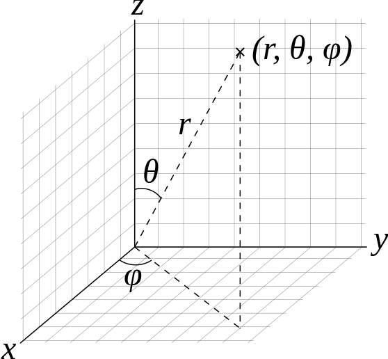
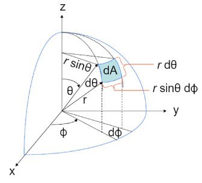
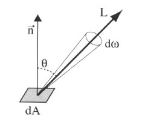
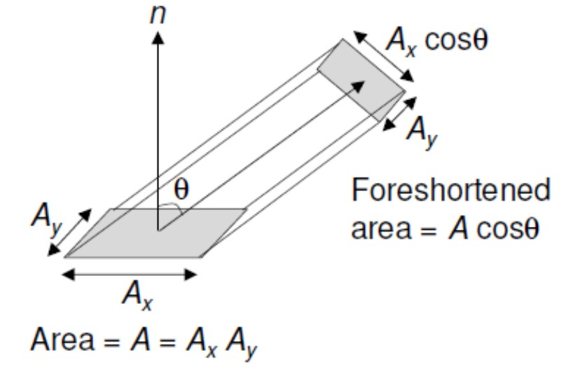
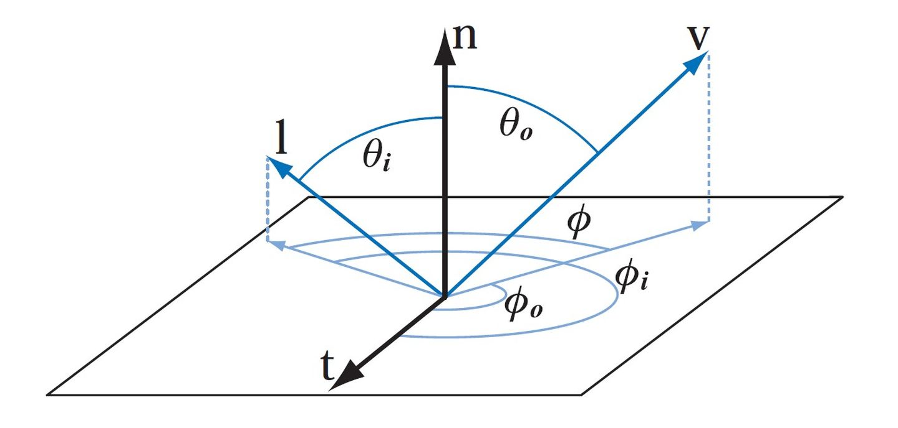
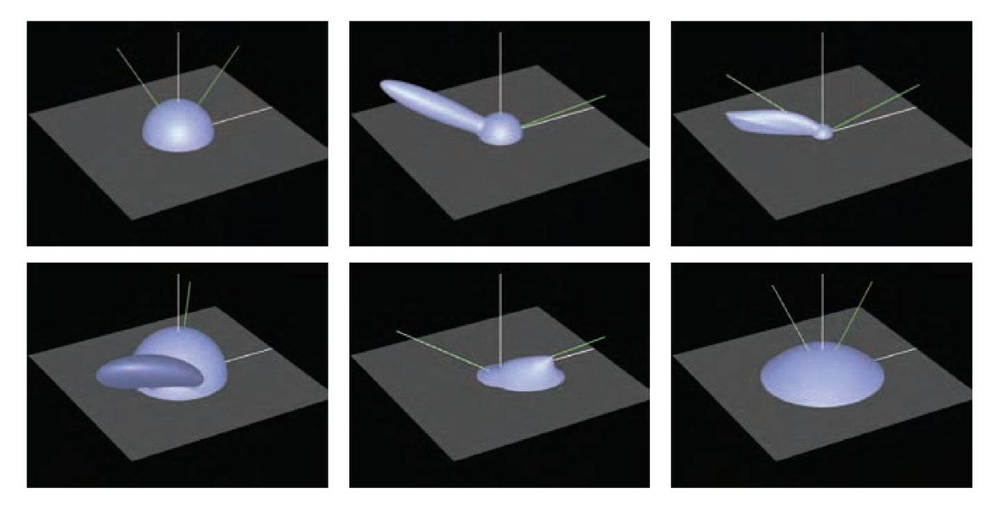
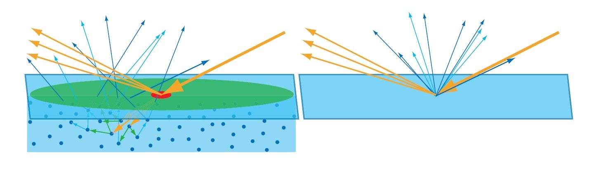
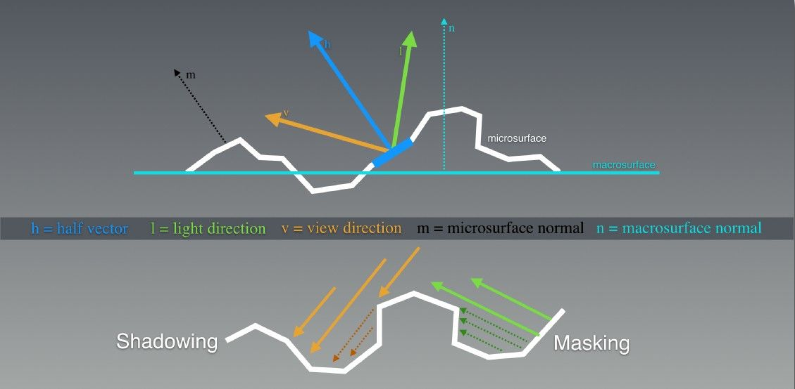
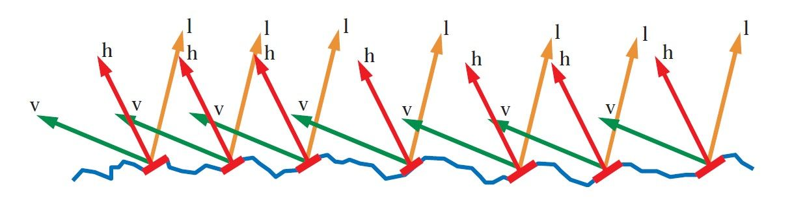
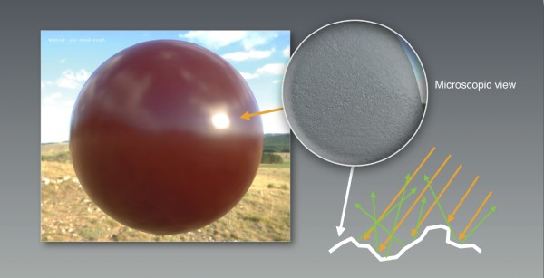

Bidirectional Reflectance Distribution Function/双向反射分布函数  
BRDF是计算机图形学中最核心的概念之一，他描述的是物体表面将光能从任何一个入射方向反射到任何一个视点方向的反射特性，即入射光线经过某个表面反射后如何在各个出射方向上分布。BRDF模型是绝大多数图形算法中描述光反射现象的基本模型
## 数学基础
### 1.1球面坐标Spherical Coordinate
  
其中:
- r表示向量的长度
- $\theta$表示向量和Z轴的夹角
- $\phi$表示向量在x-y平面上的投影和x轴的逆时针夹角。
### 1.2立体角Solid Angle

我们知道弧度是度量二维角度的量，等于角度在单元圆上对应的弧长，单位圆的周长是2π，所以整个圆对应的弧度也就是2π。立体角则是三维角度的度量，用符合Ω表示，单位为立体弧度(也叫球面度，Steradian，简写为sr)，等于立体角在单位球面上对应的区域的面积(实际上也就是在任意半径的球上除以半径的平方ω=s/(r^2))，单位球的表面积是4π，所以整个球面的立体角也是4π  
  
立体角ω有如下微分形式:  
$d\omega=\frac{dA}{r^2}$  
其中dA为面积片元。而面积微元dA在球面坐标系下可以写成:  
$dA=(rd\theta)(rsin\theta d\phi)=r^2sin\theta d\theta d\phi$  
因此:  
$d\omega=\frac{dA}{r^2}=sin\theta d\theta d\phi$

### 1.3投影面积Foreshortened Area
投影面积描述了一个屋里表面的微小区域在某个视线上的可见面积。  
对于面积微元A，则沿着与法线夹角为$\theta$方向的A的可见面积为:  
$Area=Acos\theta$  

## 2辐射度量学
### 2.1辐射通量/光通量Radiant Flux
辐射通量描述的是在单位时间穿过截面的光能，或每单位时间的辐射能量，通常用$\phi$来表示，单位是W，瓦特。  
$\phi=\frac{dQ}{dt}$  
其中的Q表示辐射能(Radiant energy)，单位是J，焦耳。

### 2.2辐射强度/发光强度Radiant Intensity
对于一个点(比如说点光源)来说，辐射强度表示单位立体角的辐射通量，用符合I表示，单位$Wsr^{-1}$，瓦特每球面度:  
$I=\frac{d\phi}{d\omega}$  
概括一下:辐射强度，表示每单位立体角的辐射通量。

### 2.3辐射率/光亮度 Radiance
辐射率(Radiance,又译作光亮度，用符号L表示)，表示物体表面沿某一方向的明亮程度，它等于每单位投影和单位立体角上的辐射通量，单位是$W\cdot sr^{-1}\cdot m^{-2}$，瓦特每球面度每平方米。在光学中，光源的辐射率，是描述非点光源时光源单位面积强度的物理量，定义为在指定方向上的单位立体角和垂直此方向的单位面积上的辐射通量。光亮度L也可以理解为发光程度I在表面dA上的积分。  
一种直观的辐射率的理解方法是:将辐射率理解为物体表面的微面元所接收的来自某方向光源的单位面积的光通量，因此截面选用垂直于该方向的截面，其面积按阴影面积技术来算。  
辐射率的微分形式:  
$L=\frac{d^2\phi}{dA\cos\theta d\omega}$  
其中:$\phi$是辐射通量，单位瓦特(W)；$\omega$是立体角，单位球面度(sr)。  
另外需要注意的是，辐射率使用物体表面沿目标方向上的投影面积，不是面积。  
概括一下:辐射率表示每单位立体角每单位投影面积的辐射通量，通常用符合L表示，单位是$W\cdot sr^{-1}\cdot m^{-2}$

### 2.4辐照度/辉度 Irradiance
辐照度(Irradiance,又译名辉度，辐射照度，用符号E表示)，指入射表面的辐射通量，即单位时间内到达单位面积的辐射通量，也就是辐射通量对于面积的密度，用符号E表示，单位$w/m^2$，瓦特每平方米。  
辐照度可以写成辐射率(Radiance)在入射光所形成的半球上的积分:  
$\frac{d\phi}{dA}=E=\int_{\Omega}L(\omega)\cos\theta d\omega$  
其中，$\Omega$是入射光所形成的半球。$L(\omega)$是沿$\omega$方向的光亮度。  

## 3BRDF
### 3.1BRDF的定义式
可以将一个表面着色的过程，理解为给定入射的光线数量和方向，计算出指定方向的出射光亮度(radiance)。在计算机图形学领域，BRDF是一个用来描述表面如何反射光的方程。顾名思义，BRDF就是一个描述光如何从给定的两个方向(入射方向I和出射方向V)在表面进行反射的函数。  
BRDF的精确定义是出射辐射率的微分和入射辐照度的微分之比:  
$f(l,v)=\frac{dL_{0}(v)}{dE(l)}$  
要理解这个方程的含义，可以想象一个表面被一个来自围绕着角度I的微立体角的入射光照亮，而这个光照效果由表面的辉度dE来决定。  

表面会反射此入射光到很多不同的方向，在给定的任意出射方向V，光亮度$dL_{0}$与辐照度dE成一个比例。而两者之间的这个取决于I和V的比例，就是BRDF。

一个最常见的疑问就是，BRDF为什么要取这样的定义。BRDF为什么定义为辐射率(radiance)和辐照度(irradiance)之比，而不是radiance和radiance之比，或者irradiance和irradiance之比呢？  

首先，我们分别重温它们的定义:
- 辐照度(irradiance)，表示单位时间内到达单位面积的辐射通量，也就是辐射通量对于面积的密度，通常用符号E表示，单位$W\cdot m^{-2}$,瓦特每平方米
- 辐射率(radiance)，表示单位立体角每单位投影面积的辐射通量，通常用符号L表示，单位是$W\cdot sr^{-1}\cdot m^{-2}$，瓦特每球面度每平方米

那么，关于这个问题，我们可以这样理解:因为照射点到入射点的不同方向的光，都可能从制度的反射方向出射，所以当考虑入射时，需要对面积进行积分。而辐照度irradiance正好表示单位时间内到达单位面积的辐射通量。所以BRDF选取入射时的辐照度irradiance，和出射时的辐射率radiance，可以简单明了地描述出入射光线经过某个表面反射后如何在各个出射方向上分布。而直观来说，BRDF的值给定了入射方向和出射方向能量的相对量。  

概括一下:BRDF定义为出射辐射率和入射辐照度的微分之比，描述了入射光线经过某个表面反射后如何在出射方向上分布，给定了入射方向和出射方向能量的相对量，单位是$sr^{-1}$，每球面度。
### 3.2BRDF的非微分形式
这里的讨论仅限于非区域光源，如点光源或者方向光源。在这种情况下，BRDF可以用非微分形式表示:  
$f(l,v)=\frac{L_{0}(v)}{E(l)\cos\theta_{i}}$  
其中:  
- E(l)是光源在垂直于光的方向向量L平面测量的辐照度(irradiance)。
- $L_{0}$是在视图矢量v的方向上产生的出射辐射率(radiance)。

### 3.3BRDF与着色方程
根据上文所了解了BRDF的定义，现在，就很容易得到BRDF是如何用n个非区域光来拟合一般的着色方程:  
$L_{0}(v)=\sum_{k=1}^nf(l_{k}, v)\times E_{L_{k}}\cos \theta_{i_{k}}$  
其中k是每个光源的索引。使用x是因为BRDF和辉度(irradiance)都是RGB向量。考虑到入射和出射方向都拥有两个自由度(通常参数化是使用两个角度:相对于表面法线的仰角$\theta$和关于法线的旋转角度$\phi$)，一般情况下，BRDF是拥有死鬼标量变量的函数。  

另外，各向同性BRDFs(Isotropic BRDFs)是一个重要的特殊情况。这样的BRDF在输入方向围绕表面法线变化(保持相同的相对夹角)时保持不变。所以，各向同性BRDF是关于三个标量的函数。

### 3.4对BRDF的可视化表示
一种理解BRDF的方法就是在输入方向保持恒定的情况下对它进行可视化表示，如下图。对于给定方向的入射光来说，图中显示了出射光的能力分布：在交点附近球形部分是漫反射分量，因此出射光来任何方向上的反射概率相等。椭圆部分是一个反射波瓣(reflectance lobe)。它形成了镜面分量。显然，这些波瓣位于入射光的反射方向上，波瓣厚度对应反射的模糊性。根据互易原理，可以将这些相同的可视化形成认为是每个不同入射光方向对单个出射方向的贡献量大小。  

## 4BRDF的性质
### 4.1可逆性
BRDF的可逆性源自于亥姆霍兹光路可逆性（Helmholtz Recoprpcity Rule）。  
BRDF的可逆性即，交互入射光与反射光，并不会改变BRDF的值:  
$f(l, v)=f(v, l)$

### 4.2能量守恒性质
BRDF需要遵循能量守恒定律。能量守恒定律指出:入射光的能量与出射光总能量应该相等。能量守恒方程如下:  
$Q_{incoming}=Q_{reflected} + Q_{absorb} + Q_{transmitted}$  
由此可知:

$Q_{reflected} \leq Q_{incoming}$

### 4.3线性特征
很多时候，材质往往需要多重BRDF计算以实现其反射特性。表面上某一点的全部反射辐射度可以简单地表示为各BRDF反射辐射度之和。例如，镜面漫反射即可通过多重BRDF计算加以实现。

## 5BRDF模型分类
根据BRDF的定义来直接应用，会有一些无从下手的感觉。而为了方便和高效地使用BRDF数据，大家往往将BRDF组织成为各种参数化的数值模型。  
有各式各样的BRDF模型，如:  
- Phong(1975)
- Blinn-Phong(1977)
- Cook-Torrance(1981)
- Ward(1992)
- Oren-Nayar(1994)
- Schlick(1994)
- Modified-Phong(Lafortune 1994)
- Lafortune(1997)
- Neumann-Neumann(1999)
- Albedo pump-up(Neumann-Neumann 1999)
- Ashikhmin-Shirley(2000)
- Kelemen(2001)
- Halfway Vector Disk(Edwards 2006)
- GGX(Walter 2007)
- Distribution-based BRDF(Ashikmin 2007)
- Kurt(2010)

这些BRDF的模型可以分为如下几类:
- 经验模型(Empirical Models):使用基于实验提成的公式对BRDF做快速估计。
- 数据驱动模型(Data-driven Models):采集真实材质表面在不同光照角度和观察角将BRDF按照实测数据建立查找表，记录在数据库中，以便于快速的查找和计算。
- 基于物理的模型(Physical-based Models):根据物体表面材料和几何以及光学属性建立反射方程，从而计算BRDF，实现极具真实感的渲染效果。

### 5.1BRDF经验模型
关于BRDF的经验模型，有如下几个要点:
- 经验模型提供简洁的公式以便于反射光线的快速计算。
- 经验模型不考虑材质的特性，仅仅提供一个反射光的粗糙近似。
- 经验模型不一定满足物理定律，比如Hemholtz可逆性或能量守恒定律。
- 经验模型因为其简洁或高效性被广泛运用。
常见的BRDF经验模型有:
- Lambert漫反射模型
- Phong模型
- Blinn-Phong模型
- 快速Phong模型
- 可逆Phong模型

### 5.2数据驱动的BRDF模型
数据驱动的BRDF模型可以理解为，度量一个大的BRDF材质集合，并将其记录为高维向量，利用降维的方法从这些数据中计算出一个低维模型，这样基于查表的方式，可以直接找到渲染结果，省去大量的实时计算。
需要注意的是，由于这些数据采集自真实材质，即使渲染出来的结果很真实，但缺点是没有可供调整的参数，无法基于这些数据改成想要的效果，另外部分极端角度由于仪器限制，无法获取到数据，而且采样点密集，数据量非常庞大，所以并不适合游戏等实时领域，一般可用在电影等离线渲染领域，也可以用来做图形学研究，衡量其他模型的真实程度。

### 5.3基于物理的BRDF模型
基于物理的渲染（PBR,Physically-based rendering)是计算机图形学中应用数学建模的方式模拟物体表面各种材质散射光线的属性从而渲染照片真实图片的计算，是近年来实时渲染领域的大趋势。  
基于物理的BRDF模型通过包含材质的各种几何及光学性质来尽可能精确的近似现实世界中的材料。而一个基于物理的BRDF要必须满足如下两条BRDF的特性:能量守恒和Helmholtz光路可逆性。  
常见的基于物理的BRDF模型:
- Cook-Torrance BRDF模型
- Ward BRDF模型

## 6基于物理的BRDF-前置知识
### 6.1次表面散射Subsurface Scattering
在真实世界中很多物体是半透明的，比如皮肤、玉、蜡、大理石、牛奶等。当光线入射到透明或者半透明材料表面时，一部分被反射，一部分会被吸收，还有一部分经历透射。这些半透明的材质受到数个光源的透射，物体本身就会受到材质的厚度影响而显示出不同的透光性，光线在这些透射部分也可以互相混合、干涉。  
次表面散射(Subsurface Scattering)，就是光入射半透明材质后在内部发生散射，最后射出物体并进入视野中产生的现象，是指光从表面进入物体经过内部散射，然后又通过物体表面的其他顶点出射的光线传递过程。  
简而言之:次表面散射，即光射入表面，在材质里面散射，然后从与入射点不同的地方射出表面的一种现象。
  
上图表示光与表面的相互作用，左图，可以看到次表面相互作用导致光从入口点重新射出。红色和绿色圆圈代表两个不同尺度下的像素所覆盖的区域。在右边，所有的次表面散射光都是从入口点发出的，忽略了表面之下的细节。
### 6.2菲涅尔反射 Fresnel Reflectance
菲涅尔方程(Fresnel equations)是一组用于描述光在两种不同折射率的介质中传播时的反射和折射的光学方程。方程中被描述的反射被称为菲涅尔反射。

菲涅尔反射或者菲涅尔效果，即当光入射到折射率不同的两个材质的分界面时，一部分光会被反射，而我们所看到的光线会根据我们的观察角度以不同强度反射的现象。  

菲涅尔反射能够真实的模拟真实世界中的反射，在真实世界中，除了金属之外，其他物质均有不同程度的菲涅尔反射效果。  

关于菲涅尔反射，一个很好的例子是一池清水。从水池垂直看下去(也就是与法线成零度角方向)的话，我们能够一直看到池底。而如果从接近平行于水面的方向看去的话，水池表面的高光反射会变得非常强以至于你看不到池底。  

简单来说，视线垂直于表面时，反射较弱，而当视线并非垂直表面时，夹角越小，反射越明显。  

对于粗糙表面来说，在接近平行方向的高光反射也会增强但不够达到100%的强度。为何如此是因为影响菲涅尔效应的关键参数在于每个微平面的法向量和入射光的角度，而不是宏观平面的法向量和入射光线的角度。因此我们在宏观层面看到的实际上是微平面的菲涅尔效应的一个平均结果。  

根据菲涅尔反射，如果你看一个圆球，那么圆球中心的反射会较弱，而靠近边缘反射较强。另外需要注意，这种关系也受折射率影响。

### 6.3微平面理论Microfacet Theory
微表面理论假设表面是由不同方向的微小细节表面，也就是微平面(microfacets)组成。每一个微小的平面都会根据它的法线方向在一个方向上反射光线。  

表面法线朝向光源方向和视线方向中的微表面会反射可见光。然而，不是所有的表面法线和半角法线(half normal)相等的微表面都会被反射光线，因为其中有些会被遮挡，如下图所示:
   

我们用法线分布函数(Normal Distribution Function，简写为NDF)，D(h)用来描述组成表面一点的所有微表面的法线分布概率。则可以这样理解:向NDF输入一个朝向h，NDF会返回朝向是h的微表面所占微表面总数的比例，比如有8%的微表面朝向是h，那么就有8%的微表面可能将光线反射到v方向。

图中由微平面组成的表面，仅仅红色微平面的表面法线能和半矢量h对齐，能参与从入射光向量l到视线向量v的反射光线。  
NDF的定义式:  
$D(h)=\frac{\alpha^2}{\pi((n\cdot h)^2(\alpha^2 - 1) + 1)^2}$  
在微观层面上不规则的表面会造成光的漫反射。例如，模糊的反射是由于光线的散射造成的。而反射的光线并不均匀，因此我们得到的高光反射是模糊的。如下图:  

## 7基于物理的BRDF-常见模型
### 7.1Cook-Torrance BRDF模型
Cook-Torrance模型作为图形学中最早的基于物理的BRDF模型，Cook-Torrance模型将物理学中的菲涅尔反射引入了图形学，实现了比较逼真的效果。  

Cook-Torrance微平面着色模型(Cook-Torrance microfacet specular shading model)，即Microfacet Specular BRDF，定义为:

$f(l, v)=\frac{F(l, v)G(l, v, h)D(h)}{4(n\cdot h)(n \cdot v)}$  
其中:
- F为菲涅尔反射函数
- G为阴影遮罩函数，即未被shadow或者mask的比例
- D为法线分布函数(NDF)