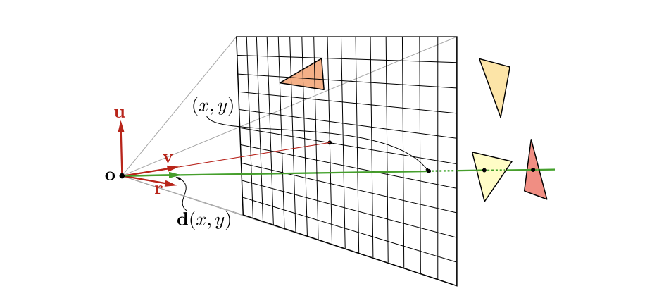
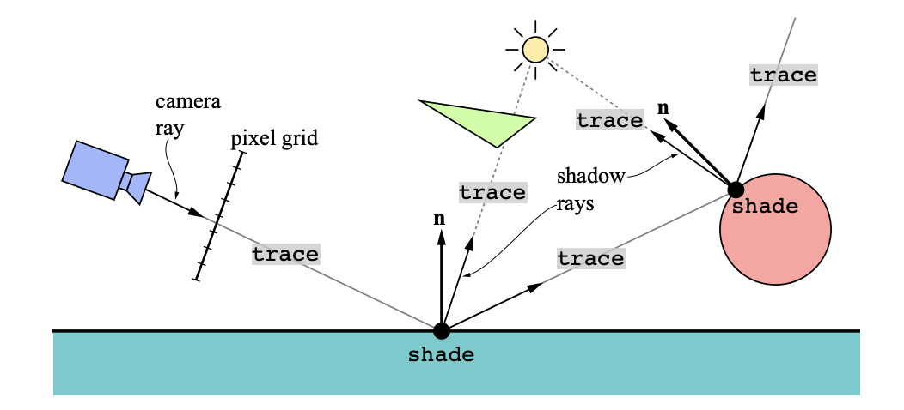
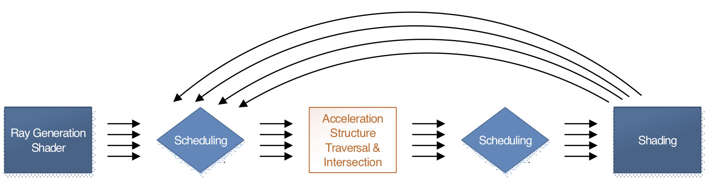

//仅仅是学习笔记，难免有错误，仅作参考
# 光栅化和光线追踪对比
光栅化和光线追踪的可见性确定可以用双循环来描述
光栅化的可见性描述
```
for (T in triangles)
    for (P in pixels)
        determine if P is inside T
```
光线追踪可见性描述
```
for (P in pixels)
    for (T in triangles)
        determine if ray through P hits T
```
需要速度快使用光栅化，需要更好的效果使用光线追踪(Use raster when faster, else rays to amaze.)  
目前业界主流的实时光线追踪技术是采用的传统光栅化渲染管线+光线追踪的混合渲染管线(Hybrid Rendering Pipeline)的形式。

# 原理
光线追踪示意图


人看见物体是因为物体反射了光线进入人眼中，光线追踪根据光路的可逆性，从人眼中发出光线射向物体，然后计算这个点的颜色，然后再反射到不同的物体上，一直递归下去，直到到达光线深度(递归深度)或者达到光源。  
注:shadow ray指交点和光源的连线，因为可以用来判断该点是否处于阴影中

## 代码描述
```
rayTraceImage()
{   //对屏幕的每一个像素进行光线追踪
    for(p in pixels)
        color of p = trace(eye ray through p);
}
trace(ray)
{   //找到与光线相交的最近的点
    pt = find closest intersection
    //对这个点进行着色
    return shade(pt);
}
shade(point)
{
    color = 0;
    for (L in light sources)
    {
        trace(shadow ray to L);
        color += evaluate BRDF;
    }
    color += trace(reflection ray);
    color += trace(refraction ray);
    return color;
}
```
# 光线追踪着色器
- 光线生成着色器(ray generation shader)
- 最近命中着色器(closest hit shader)
- 未命中着色器(miss shader)
- 任何命中着色器(any hit shader)
- 相交着色器(interstion shader)
- 可调用着色器(callable shader)  
[DXR详情参考](https://docs.microsoft.com/en-us/windows/win32/direct3d12/direct3d-12-raytracing-hlsl-shaders)  

# 优化
## 加速结构
为了加速光线与场景相交运算，需要把场景中的几何体用一种特殊的方式组织

[DXR中说明](https://microsoft.github.io/DirectX-Specs/d3d/Raytracing.html#ray-geometry-interaction-diagram)  
[vulkan中说明](https://nvpro-samples.github.io/vk_raytracing_tutorial_KHR/#accelerationstructure)
- 顶层加速结构(Top-level acceleration structure，简写TLAS)，TLAS是对象实例级别的。每个实例都指向一个BLAS，并且包含一些特定于这个实例的数据信息，例如变换矩阵，或者用于指定InstanceID用于shader中使用。我们又称这种实例为几何实例
- 底层加速结构(Bottom-level acceleration structure，简写BLAS)，BLAS是集合体级别的，对于传统的三角形Mesh，它使用Bounding Volume Hierarchy(BVH)树型数据结构来管理这些三角形。场景中的动画更新时，一般更新Top-Level hierarchy就可以了，所以效率是很高的。   

## 连贯性(Coherency)
在程序执行期间利用连贯性是硬件和软件上性能优化最重要的想法之一，在现今的硬件上，在时间和能耗上最昂贵的操作就是内存访问,大多数情况下，性能优化侧重于利用内存的连贯性（缓存）和围绕内存延迟进行调度计算。GPU 本身可被视为一个处理器，它明确约束其运行的程序（数据并行、独立计算线程）的执行模型，以便更好地利用内存的连贯性。
### 场景连贯性(Scene Coherency)
### 光线和着色连贯性(Ray and Shading Coherency)

光线追踪算法在对缓存结构是非常不友好的，为了尽可能提高光线的计算效率，一般的光线追踪实现都需要对光线进行排序，以使其算法对内存访问具有一定的连贯性。为了最大化这种光线处理(例如对场景的遍历和着色计算)的效率，这样的工作显然作为固定管线会更加合适，上图所示，shader产生rays，然后提交给固定管线，固定管线最后给出ray与表面的交点(BLAS中如果采用三角形mesh，固定管线会计算光线与三角形相交，如果是自定义的其他几何体，则需要自己实现求交算法，需要使用interstion shader)，交回给一个表面着色的shader。在这中间发生了光线对整个几何场景加速数据结构的遍历以及求交计算，这个过程完全是基于固定管线的，这个做法其实是为了在遍历和求交计算中尽可能针对GPU进行优化。上图中包含两个调度阶段，其中一个调度发生在遍历场景之前，第二个发生在着色之前，这里面的调度工作就可能包含对光线的排序，例如针对特定数据结构的优化，这样遍历的算法具有更好的并行性和对内存的连贯性，然后遍历完之后再经历一次排序，比如为了让后续的着色计算具有更好的并行性，其可能将碰撞点根据表面来排序，让同一个表面或者材质对应的光线交点放到一起计算，这样效率就会更高。
# 降噪
TODO

# 参考文献
- [《real-time rendering 4th》chapter26 real-time ray tracing](http://www.realtimerendering.com/raytracing.html)  
- https://zhuanlan.zhihu.com/p/144403005  
- https://zhuanlan.zhihu.com/p/34894883
- https://www.zhihu.com/question/310930978/answer/1606439715  
- https://jerish.blog.csdn.net/article/details/104708361  
- https://microsoft.github.io/DirectX-Specs/d3d/Raytracing.html  
- https://nvpro-samples.github.io/vk_raytracing_tutorial_KHR/#accelerationstructure